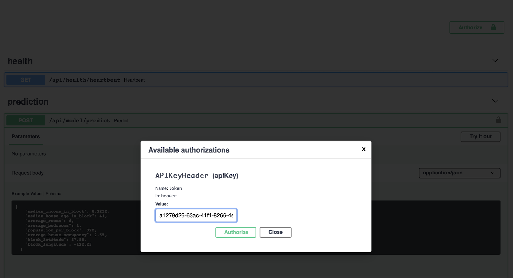

# FastAPI Tensorflow Doggo Recognition

A fast FastAPI (Get it?) by [Sebastián Ramírez](https://github.com/tiangolo) for Doggo image recognition.

## Requirements

Python 3.6+

## Installation
Install the required packages in your local environment (ideally virtualenv, conda, etc.).
```bash
pip install -r requirements
``` 

## Setup

1. In the `.env` file configure the `API_KEY` entry. The key is used for authenticating our API. <br>
   A sample API key can be generated using Python REPL:
```python
import uuid
print(str(uuid.uuid4()))
```

## Run It

1. Start your  app with: 
```bash
uvicorn "app.main:app" --reload
```

2. Go to [http://localhost:8000/docs](http://localhost:8000/docs).
   
3. Click `Authorize` and enter the API key as created in the Setup step.

   
4. You can use the sample payload from the `docs/sample_payload.json` file when trying out the house price prediction model using the API.
   
